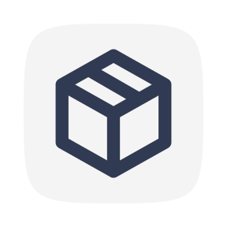

<div align="center">

<br>
<br>
<h2>Krates-Backend (based on Krates)
</h2>
<p>Krates is a free HTTP based JSON storage service. It is meant to be easy to use and easy to self-host. It lets you store, read & modify JSON data over HTTP APIs for FREE.</p>

</div>

## 🔥Features

:white_circle: **Simple :** Zero configuration required and super easy to use.

:rainbow: **Backend Agnostic :** Use krates with a backend server or directly from the browser.

:closed_lock_with_key: **Protected Krates :** Protect your krates from unauthorized access.

:rocket: **Lightning Fast :** Saving your data is just a HTTP request away.

## Documentation
**API SPEC**

**Base URL:** [your-base-url]/api

**General Information:**
- All API Endpoints are protected with a rate limiter.
- Status code 429 indicates rate limit exceeded.

**Endpoints:**

1. **Get Record Data**
   - Path: `/krate/:krateId/record/:recordId/`
   - Method: `GET`
   - Params: `krateId` should be alphanumeric and 20 characters long, `recordId` should be alphanumeric and 24 characters long.
   - Rate limit: Yes
   - Response: JSON object with Record's data.

2. **Get all Data**
   - Path: `/krate/:krateId/:collectionId?/`
   - Method: `GET`
   - Params: `krateId` should be alphanumeric and 20 characters long, `collectionId` optional and should be alphanumeric, min 1 character, max 16 characters.
   - Rate limit: Yes
   - Response: JSON object with all Data.

3. **Set Data**
   - Path: `/krate/:krateId/:collectionId?/`
   - Method: `POST`
   - Params: `krateId` should be alphanumeric and 20 characters long, `collectionId` optional and should be alphanumeric, min 1 char, max 16 characters.
   - Data: A payload of record data.
   - Headers: `'x-api-key'` expected UUID format.
   - Rate limit: Yes
   - Authentication: Yes
   - Response: JSON object containing the response to the request.

4. **Update Record Data**
   - Path: `/krate/:krateId/:recordId/`
   - Method: `PUT`
   - Params: `krateId` should be alphanumeric and 20 characters long, `recordId` should be alphanumeric and 24 characters long.
   - Data: Updated data.
   - Headers: `'x-api-key'` expected UUID format.
   - Rate limit: Yes
   - Response: JSON Object with updated data.

5. **Delete All Data**
   - Path: `/krate/:krateId/`
   - Method: `DELETE`
   - Params: `krateId` should be alphanumeric and 20 characters long.
   - Headers: `'x-api-key'` expected UUID format.
   - Rate limit: Yes
   - Response: JSON object with success message on data deletion.

6. **Delete Record Data**
   - Path: `/krate/:krateId/record/:recordId`
   - Method: `DELETE`
   - Params: `krateId` should be alphanumeric and 20 characters long, `recordId` should be alphanumeric and 24 characters long.
   - Headers: `'x-api-key'` expected UUID format.
   - Rate limit: Yes
   - Response: JSON object with success message on record deletion.

7. **Get Meta Data**
   - Path: `/meta/:krateId`
   - Method: `GET`
   - Params: `krateId` should be alphanumeric and 20 characters long.
   - Response: JSON object with meta data for a krate.

Note: The mentioned `krateId`, `recordId`, `collectionId` & `'x-api-key'` are placeholders. Replace these with actual variables at the time of use. If authentication requirement is not mentioned, it is assumed to be not required.

## Local Setup

Clone the repository to a folder of your choice.

```bash
git clone https://github.com/sumitkolhe/krates
```

This would clone the whole repository onto your machine.

## Run locally

The repository contains frontend and backend code as well. You will need to run them separately.

### Backend server

> You need MongoDB to run this application. If you don't already have MongoDB, go to the [official documentation](https://docs.mongodb.com/manual/installation/) and follow the instructions there.

Once you have MongoDB installed, run

```bash
mongo
```

Install the dependencies

```bash #
cd krates
npm install
```

Rename **.example.env** file to **.env** and fill all the required variables.

Start the backend server by running

```bash
npm run dev
```

> This will start the backend server on port `4000`

### Frontend server

Install the dependencies

```bash #
cd krates/dashboard
npm install
```

Start the frontend server by running

```bash
npm run dev
```

> This will start the frontend server on port `3000`

## ✍️ Authors

- [**Sumit Kolhe**](https://github.com/sumitkolhe) - _Author_

## 📜 License

This project is licensed under the [MIT License](https://opensource.org/licenses/MIT) - see the [LICENSE](LICENSE) file for details.
